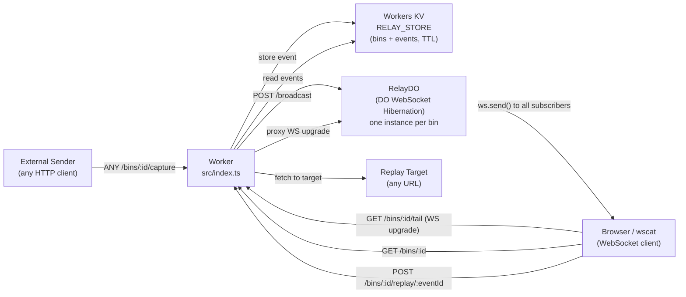

# webhook-relay

Webhook capture tool with KV event storage and real-time WebSocket broadcasting via Durable Objects Hibernation API. Inspect events via HTML UI. Replay stored events to any target URL.

## Architecture



## Endpoints

| Method | Path | Description |
|--------|------|-------------|
| `POST` | `/bins` | Create a new bin |
| `DELETE` | `/bins/:binId` | Delete bin + all events |
| `GET` | `/bins/:binId` | HTML inspector UI |
| `ANY` | `/bins/:binId/capture` | Capture incoming webhook |
| `GET` | `/bins/:binId/events` | List events (JSON) |
| `GET` | `/bins/:binId/events/:eventId` | Get single event |
| `POST` | `/bins/:binId/replay/:eventId` | Replay event to target URL |
| `GET` | `/bins/:binId/tail` | WebSocket live tail (upgrade) |

## DO WebSocket Hibernation

Uses `this.ctx.acceptWebSocket(server, ["bin:" + binId])` instead of the legacy `WebSocketPair` approach. Benefits:
- DO can hibernate between messages — no idle billing
- `getWebSockets("bin:" + binId)` retrieves all tagged subscribers for broadcast
- `webSocketMessage` / `webSocketClose` handlers called on wake

## Setup & Deploy

```bash
npm install

# 1. Create KV namespaces
npm run kv:create          # → copy id into wrangler.toml [[kv_namespaces]] id
npm run kv:create:preview  # → copy id into wrangler.toml preview_id

# 2. Deploy
npm run deploy
```

## Live WebSocket Test (MJ review)

```bash
# Terminal 1 + 2: connect two clients
npx wscat -c "wss://<worker>.workers.dev/bins/<binId>/tail"

# Terminal 3: send a webhook
curl -X POST "https://<worker>.workers.dev/bins/<binId>/capture" \
  -H "Content-Type: application/json" \
  -d '{"event": "order.created", "orderId": "123"}'

# Both wscat clients should print the event JSON in real time

# Replay
curl -X POST "https://<worker>.workers.dev/bins/<binId>/replay/<eventId>" \
  -H "Content-Type: application/json" \
  -d '{"targetUrl": "https://httpbin.org/post"}'
```

## Tests

```bash
npm test
```

Covers: bin creation, event capture + storage, list events, single event retrieval, HTML inspector, 404 handling.
